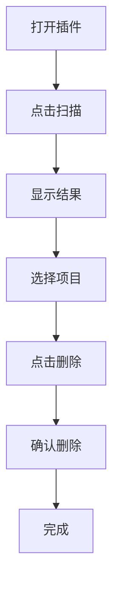

# Clean Files - Obsidian清理插件 产品需求文档

## 1. 产品概述

Clean Files是一个简洁的Obsidian清理插件，专注于识别和清理空目录和无关联文件。
插件采用最小化设计，提供核心的扫描和删除功能，帮助用户快速清理工作区。

## 2. 核心功能

### 2.1 功能模块

我们的插件只包含一个主界面，集成所有核心功能：
1. **主界面**：扫描、结果展示、删除确认

### 2.2 页面详情

| 页面名称 | 模块名称 | 功能描述 |
|---------|---------|---------|
| 主界面 | 扫描按钮 | 一键扫描空目录和无关联文件 |
| 主界面 | 结果列表 | 显示扫描到的空目录和文件，支持勾选 |
| 主界面 | 删除按钮 | 删除选中项目，包含确认对话框 |

## 3. 核心流程

**简化的用户操作流程：**

1. 用户打开插件主界面
2. 点击"扫描"按钮
3. 查看扫描结果列表
4. 勾选要删除的项目
5. 点击"删除"按钮
6. 在确认对话框中确认删除
7. 完成清理

## 4. 用户界面设计

### 4.1 设计风格

- **主色调**：遵循Obsidian默认主题
- **按钮样式**：简单的圆角按钮，删除按钮使用红色
- **字体**：使用Obsidian默认字体
- **布局风格**：简单的垂直布局
- **图标风格**：使用Obsidian内置图标

### 4.2 页面设计概览

| 页面名称 | 模块名称 | UI元素 |
|---------|---------|--------|
| 主界面 | 扫描按钮 | 大按钮，居中显示 |
| 主界面 | 结果列表 | 简单列表，每项带复选框 |
| 主界面 | 删除按钮 | 红色按钮，底部显示 |