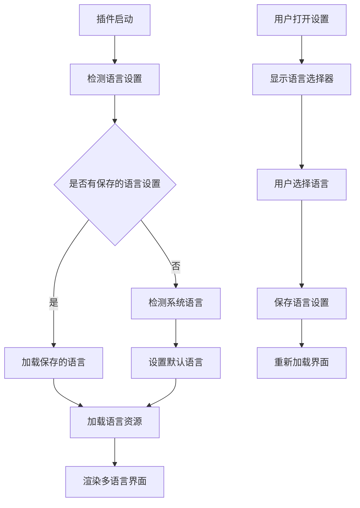

# Clean Files 插件多语言支持产品需求文档

## 1. 产品概述

为Clean Files插件添加多语言支持功能，使插件能够支持中文和英文两种语言界面，提升用户体验和国际化水平。
该功能将使不同语言背景的用户都能够轻松使用插件的所有功能，包括文件扫描、清理操作和设置配置。
目标是创建一个灵活、可扩展的多语言系统，为后续添加更多语言支持奠定基础。

## 2. 核心功能

### 2.1 用户角色
本功能不涉及用户角色区分，所有Obsidian用户都可以使用多语言功能。

### 2.2 功能模块
多语言支持功能包含以下核心页面和模块：
1. **语言选择设置**：在插件设置页面添加语言选择选项
2. **主界面多语言**：扫描结果显示界面支持多语言
3. **设置页面多语言**：所有设置项和描述支持多语言
4. **通知消息多语言**：操作提示和错误消息支持多语言

### 2.3 页面详情

| 页面名称 | 模块名称 | 功能描述 |
|---------|---------|---------|
| 设置页面 | 语言选择器 | 提供中文/英文语言切换下拉选择框，实时切换界面语言 |
| 设置页面 | 设置项本地化 | 所有设置项标题、描述文本支持多语言显示 |
| 主扫描界面 | 界面文本本地化 | 标题、按钮、状态提示等所有文本支持多语言 |
| 主扫描界面 | 扫描结果本地化 | 文件类型标签、统计信息、操作按钮等支持多语言 |
| 确认对话框 | 对话框本地化 | 删除确认对话框的所有文本支持多语言 |
| 通知系统 | 消息本地化 | 成功、错误、警告等所有通知消息支持多语言 |

## 3. 核心流程

用户可以通过以下流程使用多语言功能：

**语言设置流程：**
1. 用户打开插件设置页面
2. 在语言设置区域选择所需语言（中文/英文）
3. 界面立即切换到选定语言
4. 语言设置自动保存到插件配置中

**多语言使用流程：**
1. 插件启动时自动检测系统语言或使用已保存的语言设置
2. 加载对应语言的文本资源
3. 所有界面元素显示为选定语言
4. 用户操作过程中的所有反馈信息都使用选定语言

## 4. 用户界面设计

### 4.1 设计风格
- **主色调**：保持与Obsidian主题一致的配色方案
- **按钮样式**：使用Obsidian标准的圆角按钮样式
- **字体**：使用系统默认字体，确保中英文显示效果良好
- **布局风格**：采用简洁的卡片式布局，语言选择器集成到设置页面中
- **图标样式**：使用简洁的文字标识，避免复杂图标

### 4.2 页面设计概览

| 页面名称 | 模块名称 | UI元素 |
|---------|---------|--------|
| 设置页面 | 语言选择器 | 下拉选择框，显示"中文"和"English"选项，带有当前选中状态指示 |
| 设置页面 | 设置项标题 | 使用对应语言的标题文本，保持原有样式和布局 |
| 主界面 | 标题栏 | 显示"Clean Files - 清理文件"或"Clean Files - File Cleaner" |
| 主界面 | 按钮组 | "删除选中项目"/"Delete Selected"等按钮文本本地化 |
| 主界面 | 状态提示 | "正在扫描..."/"Scanning..."等状态文本本地化 |
| 确认对话框 | 对话框内容 | 确认删除的提示文本和按钮文本完全本地化 |

### 4.3 响应式设计
界面保持原有的响应式设计，多语言文本长度差异通过弹性布局自动适应，确保在不同语言下都有良好的显示效果。