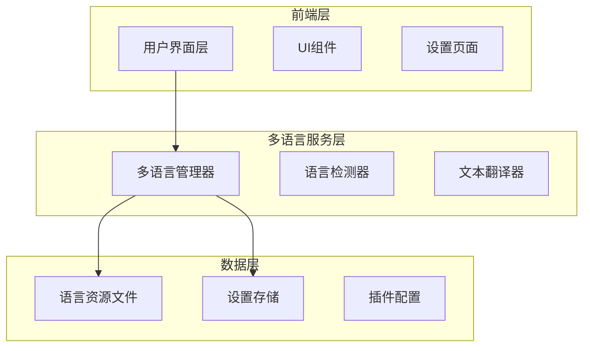
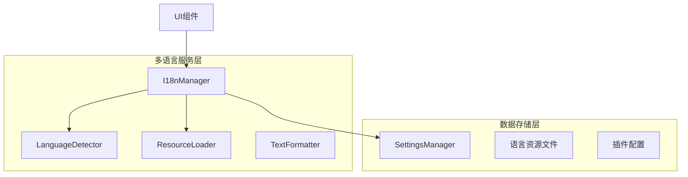
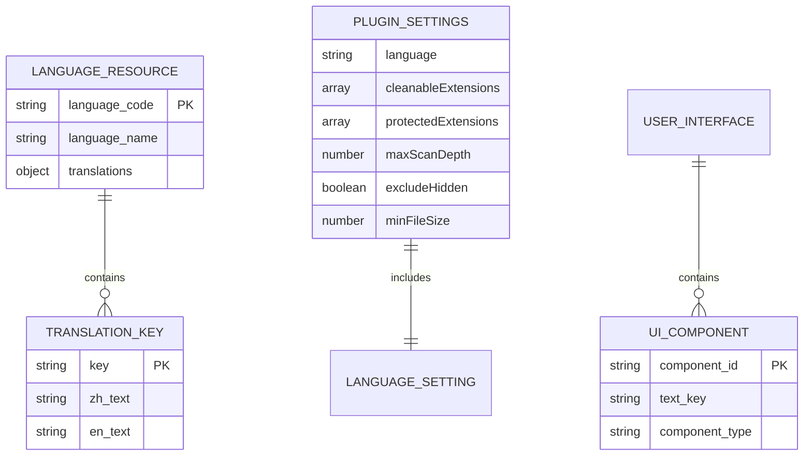

# Clean Files 插件多语言支持技术架构文档

## 1. 架构设计



## 2. 技术描述

- 前端：TypeScript + Obsidian API
- 多语言框架：自定义轻量级i18n系统
- 存储：Obsidian插件设置系统
- 语言资源：JSON格式的静态资源文件

## 3. 路由定义

| 路由 | 用途 |
|------|------|
| /settings | 插件设置页面，包含语言选择器 |
| /main | 主扫描界面，显示多语言内容 |
| /confirm | 确认对话框，多语言提示信息 |

## 4. API定义

### 4.1 核心API

多语言管理器接口
```typescript
interface I18nManager {
    getCurrentLanguage(): string;
    setLanguage(language: string): Promise<void>;
    t(key: string, params?: Record<string, any>): string;
    detectSystemLanguage(): string;
}
```

语言资源接口
```typescript
interface LanguageResource {
    [key: string]: string | LanguageResource;
}
```

设置接口扩展
```typescript
interface CleanFilesSettings {
    // 现有设置...
    language: string; // 新增语言设置
}
```

### 4.2 多语言API

获取当前语言
```
GET getCurrentLanguage()
```

Response:
| 参数名 | 参数类型 | 描述 |
|--------|----------|------|
| language | string | 当前语言代码 (zh-CN, en-US) |

设置语言
```
POST setLanguage(language: string)
```

Request:
| 参数名 | 参数类型 | 是否必需 | 描述 |
|--------|----------|----------|------|
| language | string | true | 目标语言代码 |

Response:
| 参数名 | 参数类型 | 描述 |
|--------|----------|------|
| success | boolean | 设置是否成功 |

翻译文本
```
GET t(key: string, params?: Record<string, any>)
```

Request:
| 参数名 | 参数类型 | 是否必需 | 描述 |
|--------|----------|----------|------|
| key | string | true | 翻译键名 |
| params | object | false | 插值参数 |

Response:
| 参数名 | 参数类型 | 描述 |
|--------|----------|------|
| text | string | 翻译后的文本 |

## 5. 服务架构图



## 6. 数据模型

### 6.1 数据模型定义



### 6.2 数据定义语言

语言资源文件结构 (zh-CN.json)
```json
{
    "common": {
        "confirm": "确认",
        "cancel": "取消",
        "delete": "删除",
        "select_all": "全选",
        "clear_selection": "取消选择"
    },
    "ui": {
        "title": "Clean Files - 清理文件",
        "scanning": "正在扫描文件，请稍候...",
        "scan_complete": "扫描完成",
        "no_results": "没有发现需要清理的文件",
        "empty_directories": "空目录",
        "unlinked_files": "无关联文件",
        "delete_selected": "删除选中项目",
        "confirm_delete": "确认删除",
        "delete_warning": "您确定要删除以下 {count} 个项目吗？此操作不可撤销。"
    },
    "settings": {
        "title": "Clean Files 设置",
        "language": "界面语言",
        "language_desc": "选择插件界面显示语言",
        "cleanable_extensions": "需要清理的文件扩展名",
        "cleanable_extensions_desc": "这些扩展名的文件将被识别为可清理文件",
        "protected_extensions": "保护的文件扩展名",
        "protected_extensions_desc": "这些扩展名的文件将被保护，不会被清理",
        "max_scan_depth": "最大扫描深度",
        "max_scan_depth_desc": "设置扫描文件夹的最大深度（0表示无限制）",
        "exclude_hidden": "排除隐藏文件",
        "exclude_hidden_desc": "是否在扫描时排除隐藏文件和文件夹",
        "min_file_size": "最小文件大小 (字节)",
        "min_file_size_desc": "只扫描大于此大小的文件（0表示扫描所有文件）",
        "reset_settings": "重置设置",
        "reset_settings_desc": "将所有设置重置为默认值"
    },
    "messages": {
        "scan_started": "开始扫描文件...",
        "scan_failed": "扫描失败: {error}",
        "no_items_found": "未发现需要清理的文件",
        "items_found": "发现 {count} 个项目需要清理",
        "select_items_first": "请先选择要删除的项目",
        "deleting_files": "正在删除文件...",
        "delete_success": "成功删除 {count} 个项目",
        "delete_partial": "删除完成，但有 {count} 个错误",
        "delete_failed": "删除失败: {error}"
    }
}
```

语言资源文件结构 (en-US.json)
```json
{
    "common": {
        "confirm": "Confirm",
        "cancel": "Cancel",
        "delete": "Delete",
        "select_all": "Select All",
        "clear_selection": "Clear Selection"
    },
    "ui": {
        "title": "Clean Files - File Cleaner",
        "scanning": "Scanning files, please wait...",
        "scan_complete": "Scan completed",
        "no_results": "No files found that need cleaning",
        "empty_directories": "Empty Directories",
        "unlinked_files": "Unlinked Files",
        "delete_selected": "Delete Selected Items",
        "confirm_delete": "Confirm Delete",
        "delete_warning": "Are you sure you want to delete the following {count} items? This action cannot be undone."
    },
    "settings": {
        "title": "Clean Files Settings",
        "language": "Interface Language",
        "language_desc": "Select the display language for the plugin interface",
        "cleanable_extensions": "Cleanable File Extensions",
        "cleanable_extensions_desc": "Files with these extensions will be identified as cleanable",
        "protected_extensions": "Protected File Extensions",
        "protected_extensions_desc": "Files with these extensions will be protected from cleaning",
        "max_scan_depth": "Maximum Scan Depth",
        "max_scan_depth_desc": "Set the maximum depth for scanning folders (0 means unlimited)",
        "exclude_hidden": "Exclude Hidden Files",
        "exclude_hidden_desc": "Whether to exclude hidden files and folders during scanning",
        "min_file_size": "Minimum File Size (bytes)",
        "min_file_size_desc": "Only scan files larger than this size (0 means scan all files)",
        "reset_settings": "Reset Settings",
        "reset_settings_desc": "Reset all settings to default values"
    },
    "messages": {
        "scan_started": "Starting file scan...",
        "scan_failed": "Scan failed: {error}",
        "no_items_found": "No files found that need cleaning",
        "items_found": "Found {count} items that need cleaning",
        "select_items_first": "Please select items to delete first",
        "deleting_files": "Deleting files...",
        "delete_success": "Successfully deleted {count} items",
        "delete_partial": "Deletion completed with {count} errors",
        "delete_failed": "Deletion failed: {error}"
    }
}
```

扩展的插件设置
```typescript
interface CleanFilesSettings {
    language: string; // 'zh-CN' | 'en-US'
    cleanableExtensions: string[];
    protectedExtensions: string[];
    maxScanDepth: number;
    excludeHidden: boolean;
    minFileSize: number;
}
```