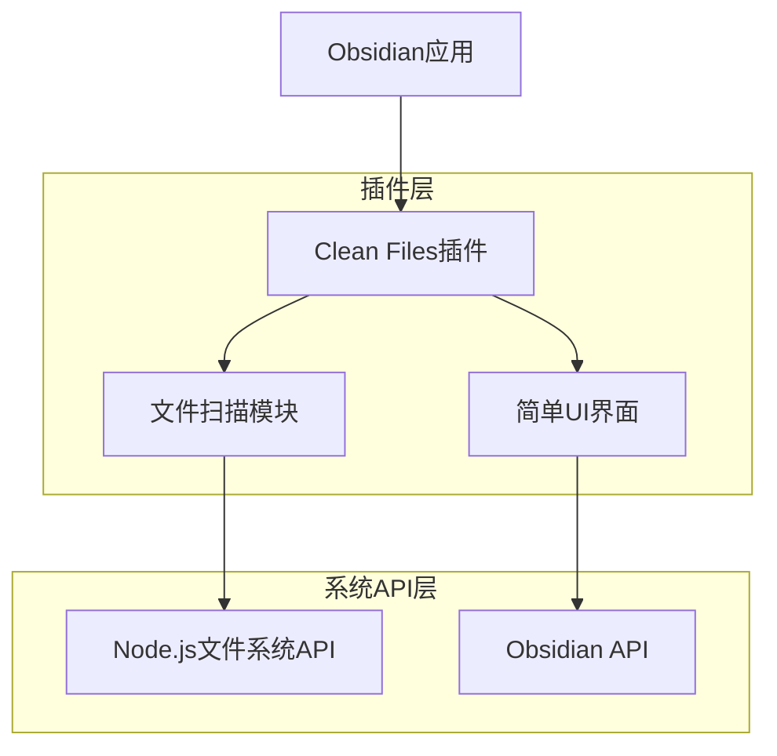
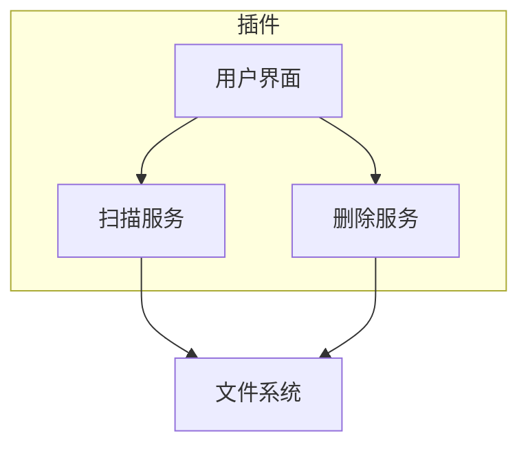

# Clean Files - Obsidian清理插件 技术架构文档

## 1. 架构设计



## 2. 技术描述

* 前端：TypeScript + Obsidian Plugin API

* 构建工具：esbuild

* 包管理：pnpm

* 文件系统：Node.js fs模块

## 3. 界面定义

插件只有一个主界面，通过Obsidian的侧边栏或命令面板打开。

## 4. API定义

### 4.1 核心API

文件扫描

```typescript
scanFiles(): Promise<ScanItem[]>
```

删除操作

```typescript
deleteItems(items: string[]): Promise<boolean>
```

类型定义：

```typescript
interface ScanItem {
    path: string;
    name: string;
    type: 'file' | 'directory';
}
```

## 5. 插件架构



## 6. 核心逻辑

插件无需复杂的数据存储，直接扫描文件系统并提供删除功能。

核心文件类型过滤：

* 保留：.md, .canvas, .pdf 等Obsidian支持的格式

* 清理：其他所有文件类型和空目录
  enableBackup: true,
  confirmBeforeDelete: true,
  maxScanDepth: 10,
  lastScanTime: ''
  };

// 扫描历史数据结构
interface ScanHistory {
id: string;
scanTime: Date;
emptyDirectories: string\[];
unlinkedFiles: FileInfo\[];
deletedItems: string\[];
totalSize: number;
}

````

文件类型过滤配置
```typescript
// Obsidian支持的文档格式（需要排除的格式）
const OBSIDIAN_SUPPORTED_FORMATS = [
    '.md', '.canvas', '.pdf', '.jpg', '.jpeg', 
    '.png', '.gif', '.svg', '.webp', '.mp3', 
    '.wav', '.mp4', '.webm', '.ogv'
];

// 需要清理的文件类型
const CLEANABLE_FILE_TYPES = [
    '.tmp', '.log', '.cache', '.bak', '.old',
    '.swp', '.swo', '.DS_Store', 'Thumbs.db'
];
````

